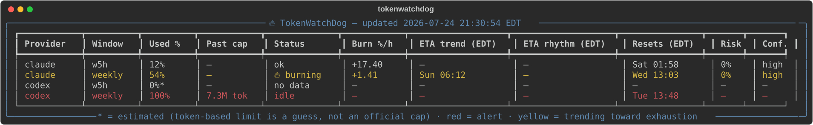

<p align="center">
  
</p>

<h1 align="center">TokenWatchDog</h1>

<p align="center">
  A local watchdog for <b>Codex CLI</b> and <b>Claude Code</b> usage quota —
  polls your 5-hour and weekly limits, alerts before you hit them, and
  predicts when each window will actually run out.
</p>

<p align="center">
  
</p>

---

## Why

Codex and Claude Code both cap usage on a 5-hour and a weekly window, and
it's easy to blow through either one mid-task. TokenWatchDog polls your
local usage data every minute and answers two questions existing usage
trackers don't:

- **When will I actually run out?** Not "you're at 62%" — an ETA, computed
  from your own recent burn rate, capped sensibly at the window's reset. That
  rate comes from real token throughput, not from the slope of the reported
  percentage: both providers round that percentage to whole numbers, and a
  weekly window burned evenly moves ~0.6% an hour, so the integer doesn't
  change often enough to forecast from at all.
- **When will I run out, given I only work certain hours?** The weekly
  projection can count only your configured working hours instead of
  assuming you burn quota 24/7 — so "exhausts Thursday" means Thursday
  *during work*, not Thursday at 3am.

It also alerts at 90% usage and separately when quota is being burned fast
enough that it will run out before the window naturally resets.

## Features

- Polls Codex CLI and Claude Code quota (5-hour + weekly) on a configurable
  interval (default ~1 minute)
- Burn rate measured from per-request token throughput, converted to %/h by a
  ratio calibrated against the provider's own reported percentage — so it
  needs no knowledge of an unpublished token cap, and falls back to the
  percentage's own slope (marked `~` in the dashboard) when there's nothing
  to calibrate against
- Two exhaustion predictors: a robust (outlier-resistant) burn-rate fit by
  default, or an opt-in Monte Carlo model that learns your hour-of-week usage
  rhythm from token history and simulates a P50/P90 exhaustion band plus a
  probability of running out before the reset, instead of one point guess
- **Two ETAs side by side, because they answer different questions.**
  **ETA on burn %/h** projects the displayed recent burn rate around the clock;
  **Predicted ETA (P50 → P90)** spreads the same budget over how you actually
  use it across a week — learned from your token history as a percentile
  range, or from your configured working hours while that profile is thin.
  Both models run every tick, so their disagreement is visible rather than
  hidden behind a config switch
- Each ETA is capped independently against the next reset — an ETA past the
  reset describes an event that can't happen, and no window is ever projected
  to take longer to exhaust than its own duration
- `predictor.model = "auto"` grades every model against **your** stored
  forecasts on a dense fixed-horizon metric (predicted used% at +1h/+24h vs
  what actually happened), and switches only when a challenger beats BOTH the
  default AND a persistence baseline ("nothing changes") by a real margin on
  matched moments — without being materially worse on any single window. It
  reports which it chose and why, and declines rather than switching on a
  sample too small to mean anything
- Staleness applies to the burn *rate*, not the used-% *level*: on a fixed
  window quota doesn't un-consume while you're away, so a 100%-used reading
  still alerts once its cycle is confirmed live. The burn-rate ETA disappears
  when that rate is stale, while the learned prediction may continue from an
  in-cycle level. Codex's weekly window is the exception — it's a *rolling*
  sum whose level decays on its own, so a stale reading there is never
  vouched for.
  If the provider cannot prove the cycle while idle, the latest compatible
  saved percentile forecast remains visible as `saved` until its P50 passes
  or one quota-window duration elapses
- `scripts/backtest.py` replays your stored history to score each predictor
  (ETA coverage, mean error, bias, P90 calibration, the dense fixed-horizon
  metric with its persistence baseline, and risk-probability calibration
  against a base-rate benchmark), so "which model is better" is a
  measurement rather than an argument
- 90%-usage alert and a separate "burning too fast" alert, both native
  notifications with a cute spoken "Woof! Woof!" by default (any system
  sound name works too, or turn notifications off entirely with
  `notifications.enabled = false` in `config.toml`), each de-duplicated so
  you get at most one ping per window
- Persists history locally (SQLite) so the Monte Carlo model has real data
  to learn from, from the very first run
- Terminal dashboard UI — rows highlight red for an active alert, at 100%
  used, or yellow for usage trending toward exhaustion — with a `--headless`
  mode for running as a background agent
- Works with either provider alone or both at once; gracefully shows "no
  data" instead of guessing when a provider doesn't expose a window
- Once either provider's own reported percentage pins at 100%, burn rate
  alone goes blind — so the usage cell keeps counting real tokens spent past
  that point (from the same session/token logs) in parentheses, as
  `100% (+7.5M)`, and shows a `$` estimate instead of a raw token count
  once you set your plan's real
  overage rate: `codex.input_price_per_million_usd` /
  `output_price_per_million_usd` for Codex, or the same plus
  `cache_write_price_per_million_usd` / `cache_read_price_per_million_usd`
  under `[claude]` (Anthropic prices cache tokens on their own tiers). All
  default to `0`, i.e. off — this tool never guesses a price for you

## Quickstart

Requires Python 3.13+.

```bash
git clone https://github.com/joshchu/tokenwatchdog.git
cd tokenwatchdog
uv sync
uv run python -m tokenwatchdog
```

That opens a live terminal dashboard — press space to refresh immediately
instead of waiting out the poll interval, Ctrl-C to quit. Useful variants:

```bash
uv run python -m tokenwatchdog --once       # one reading, then exit
uv run python -m tokenwatchdog --headless   # poll loop, alerts only, no UI
uv run python -m tokenwatchdog --reset-data # clear learned/saved data, then exit
```

Config lives at `~/.tokenwatchdog/config.toml` (created with sane defaults on
first run) — poll interval, working hours, alert thresholds, which
providers/windows to watch, and notification settings all live there.
History is stored in `~/.tokenwatchdog/history.db`. Use `--reset-data` to
delete usage samples, token events, forecasts, alert state, and ingestion
cursors while preserving configuration and the original Codex/Claude logs.
The reset time is saved so rescanning those logs cannot silently restore
pre-reset training history; only usage at or after the reset is learned.
Stop any already-running TokenWatchDog process before resetting, then restart
it so its in-memory model choice is refreshed too. Do not delete `history.db`
manually: that would also delete the reset boundary and allow old logs to be
imported again.

## The metrics

### Dashboard columns

One row per quota — each provider's 5-hour and 7-day windows are independent
caps and are predicted separately. All wall-clock columns are shown in
`timezone` from your config, with the abbreviation in the header so a local
time is never misread as UTC.

| Column | What it means |
|---|---|
| **Provider** / **Window** | `codex` or `claude`, and which cap: `w5h` (5-hour) or `weekly` (7-day). |
| **Used %** | How much of the window is gone. Whole numbers, because that's the resolution both providers report. A trailing `*` means the number is not a percentage the provider stated: either it was computed from token counts against an unpublished limit (Claude's `tokens` source), or the row is `no_data` and the `0%` is a placeholder standing in for a reading that doesn't exist. Once the percentage pins at 100, what you've spent *past* the cap follows in parentheses — `100% (+7.5M)` for 7.5M tokens beyond it, or `100% (+$12.34)` once your plan's overage rates are configured. A percentage can't climb past 100, so that figure is the only thing still moving at the moment spending stops being free. It's absent for a source with no per-request token history (Claude Desktop), since there'd be nothing to sum. |
| **Status** | `ok` — live, and not on pace to exhaust. `🔥 burning` — on pace to hit 100% before the reset. `idle` — the newest reading is older than this window's staleness threshold (10 min for 5-hour, 3 h for weekly, both configurable), so no *rate* can be measured; the **Used %** level still counts. `reset_pending` — the window just turned over and there's only one reading in the new cycle. `no_data` — the provider isn't reporting this window at all (today, Codex's 5-hour). |
| **Burn %/h** | Percent of *this window's* quota consumed per hour at the currently measured rate — not tokens per hour, and not a share of anything else, so it divides straight into the percent remaining. Normally measured from real token throughput and converted by the percent-per-token calibration; a trailing `~` means it fell back to the slope of the reported percentage itself, which is quantized to whole numbers and therefore coarse. `—` on any row that isn't live (`idle`, `no_data`, `reset_pending`), because a rate is the one thing a stale reading can't support. |
| **ETA on burn %/h** | When the window runs out if the displayed recent burn rate continues around the clock. It is the direct counterpart to **Burn %/h**: percent remaining divided by that rate, rendered as a weekday and time. |
| **Predicted ETA (P50 → P90)** | When it runs out *given how you actually use this across a week*. `Sat 08:53 → Mon 19:46` is a full range: the left timestamp is the median simulated exhaustion time (P50), and the right is the later 90th-percentile time (P90). `P50 Sat 08:53` means a median exists but fewer than 90% of simulations exhaust before reset. `hours Sat 08:53` is the configured-working-hours fallback while the learned profile is thin. `safe (risk 4%)` means a fresh simulation ran and MOST futures survive to the reset — an answer, not an absence — with the tail risk spelled out. On an `idle` row, `saved ...` is the latest persisted percentile result based on the same last-used percentage; it is display context only and never drives alerts. |
| **Resets** | When this window's quota refills. Reported directly by Codex — though its weekly value is a rolling projection that slides as old usage ages out, not a fixed boundary. For Claude's 5-hour window it's derived from the earliest account-wide evidence of the block's start (an observed expiry drop, the percentage rising from zero, or the first post-gap CLI activity — whichever saw it first); `—` for Claude's weekly window until a reset is actually observed. |
| **Risk** | Probability of exhausting before that reset — the share of simulated futures that reach 100% in time. Worth seeing separately from the ETA: a 40% chance of running out matters even when the median future doesn't. Only present while a simulating model is running, and the column is hidden entirely when no model produces one. |
| **Conf.** | How much evidence is behind the estimate: `high` at 10+ observations, `medium` at 3+, else `low`. The hour-of-week models additionally downgrade it by how much of the period being projected actually has data (below 50% coverage is `low` regardless); coverage can only lower a rating, never raise it. Under the default `linear` there's no profile to cover, so what you see is the observation count alone. |

Both ETA columns render as weekday + time and are capped at the window's own
reset — or at the window's duration when no reset is known yet — so an ETA is
strictly less than a week out and the weekday is unambiguous (assuming a
provider-reported reset really is the next one; nothing re-clamps it).

A blank ETA is a real answer rather than a missing one. **ETA on burn %/h**
is blank on an `idle`, `no_data`, or `reset_pending` row because there is no
live rate to extend. **Predicted ETA** may remain on an `idle` row; when a fresh simulation ran
and most futures survive to the reset it reads `safe (risk N%)` rather than
going blank, and it is blank only when neither a current simulation nor an
eligible saved prediction exists or the history is too thin.
A saved result is eligible only while its used percentage still matches the
displayed level, its P50 remains in the future, no newer reset or active result
has invalidated it, and it is less than one quota-window duration old.

Row colors track the alert conditions: **red** for something that fired or
would fire (100% used or over the warn threshold — while the level can still
be vouched for — or burning with an imminent ETA), **yellow** for the weaker
"on pace to exhaust before reset." A fixed-cycle 100% stays red through an
idle stretch for as long as its known cycle is live; a stale *rolling* 100%
does not, because that number may have already decayed. The dog in the title
follows the same rules — 🐶 calm, 🐕 at the warn threshold, 🔥 burning.

### Backtest scores

`scripts/backtest.py` prints one block per window (with how many samples,
hours, cycles, and token events it had to work with) and one row per model:

| Score | What it means |
|---|---|
| **coverage** | Share of replayed moments where the model produced an ETA at all. Low isn't automatically bad — declining to guess from a signal too coarse to forecast is correct — but a model that's usually silent can't be graded on much. |
| **scored** | Of those, how many belong to a cycle that reached 100% later, so an error is computable. Real exhaustions are the scarce resource — a weekly window supplies at most a couple a week — but be careful: this counts forecast *moments*, and many moments can belong to one exhaustion. See the caveat below. |
| **MAE h** | Mean absolute error of the ETA, in hours. |
| **bias h** | Mean *signed* error. Positive means the ETAs ran late (predicting exhaustion after it happened); negative means early and alarmist. Tracked separately because the two directions aren't equally costly, and because a change can meaningfully cut bias while leaving MAE inside the noise. |
| **P90 hit** | Calibration of the band: how often the truth actually landed at or before the model's P90. A well-calibrated P90 sits near 90% — much higher means the band is wider than it needs to be, much lower means it's overconfident. Blank for models that don't produce a band. |
| **dense used% at +h** | The decision metric — what `auto` actually switches on. Each model's own predicted level at the window's decision horizon (+1h for 5-hour, +24h for weekly) against what the store later recorded, in percentage points, on moments where *every* model answered, with a `persistence` row ("nothing changes") on the same moments as the bar to clear. |
| **risk** | Probability calibration: the Risk column's claims against 0/1 outcomes — a Brier score next to the always-guess-the-base-rate benchmark, plus a reliability table (claimed band → realized frequency). A Brier above the benchmark means the probability is worse than uninformative, however precise it renders. |

An episode has to *start* below the cap and cross it. A moment already at
100% is not one: every model trivially answers "exhausted now," so scoring it
measured the gap to the next stored sample — the ~5-minute cadence of the
underlying data — and called that forecast error. That inflated MAE into
something flattering (0.1h without forecasting anything), made `P90 hit`
read 0% for arithmetic rather than calibration reasons (a P90 of 0.0h cannot
contain a positive truth), and, worst, let a saturated stretch mint one
scorable episode per tick for whichever model still answers at the cap —
about 120 in two hours for the simulating model against 9 for the default,
enough to clear the graduation bar and promote the *worse* model. Excluding
at-cap origins fixes all three.

Two things to still keep in mind when reading the table:

- **Exhaustion episodes are a diagnostic, not the decision.** `scored` counts
  forecast moments, and many correlated forecasts made while climbing toward
  one exhaustion each count separately — on early history, 14 episodes
  pointed at just 2 real crossings. Nothing gates on that count anymore;
  `auto` decides on the dense metric, which accumulates hundreds of matched
  moments per day and carries its own ≥500-moment / ≥15%-margin /
  beat-persistence bars.
- **`P90 hit` is conditional**, on an episode both producing a band and then
  exhausting, so it isn't a full unconditional calibration check — the risk
  section is the unconditional one. It prints `—` while no genuine episode
  has carried an uncensored P90.

The footer states whether the replay's dense sample is decidable. Treat it as
describing the replay only — it and the runtime `auto` gate share a
definition but not their inputs (replayed forecasts versus stored ones).

## How it works

TokenWatchDog reads quota data **from your own machine and your own
providers, nothing else**, and never touches credentials — each vendor's
own binary owns its auth. For Claude, the freshest reading comes from
spawning Claude Code's own CLI — `claude -p "/usage"`, a free, LLM-less
local slash command that reports the server's numbers — with Claude
Desktop's usage snapshot and Claude Code's transcripts as fallbacks. For
Codex it likewise asks the codex binary itself — a short-lived
`codex app-server` query (`account/rateLimits/read`, the same read behind
the Codex desktop app's usage display; no LLM call, no quota spent) — with
its session rollout files as the fallback: rollouts only record a snapshot
when a local turn completes, so usage burned on Codex web/cloud or another
machine is invisible to them until then. The only network traffic is what
the `claude` and `codex` binaries themselves send to their own vendors to
answer those queries: TokenWatchDog holds no tokens, calls no API of its
own, and never transmits anything anywhere. The session logs it parses do
contain your conversation history, but only numeric usage fields (token
counts, timestamps, model names) are ever extracted — the message content
itself is never logged, stored, or transmitted anywhere.

Burn rate is measured from token throughput wherever possible. Neither
provider publishes its real token cap, so instead of guessing one, the tool
measures how much of the window one token actually consumed — the reported
percentage's movement across the current cycle, divided by the tokens spent
over that same span — and uses that ratio to turn recent tokens/hour into
%/h. It refuses to calibrate from a cycle that hasn't moved at least a few
points, or one that ends pinned at 100%, and falls back to the percentage's
own slope in those cases. On Codex's rolling weekly window — where the level
rises and falls as old usage ages out, confounding a whole-cycle delta — it
calibrates on the most recent rising stretch instead.

Two models run each tick. **ETA on burn %/h** comes from a robust
(outlier-resistant) fit of the recent rate, projected forward to when usage
would hit 100% — capped at the window's own reset, or at its duration when no
reset time has been derived yet. **Predicted ETA** buckets historical burn by
hour-of-week and simulates thousands of random futures to produce a P50/P90
band and a probability of exhausting before the reset. Because that bucketing
is built from token history, an hour with no requests contributes a real zero
rather than no data at all — which is what lets it learn that you don't burn
quota overnight, instead of filling those hours in from your daytime average.
Each simulated future starts from what is happening *right now*: the first
hour burns at the live measured rate — the same number the Burn %/h column
shows — handing off to the learned profile within the hour (measured: the
rate's magnitude decays to roughly a third by the next hour, and giving the
live rate more reach than that measurably degraded both accuracy and risk
calibration). That is what lets a burst that started ten minutes ago move
the near-term prediction instead of being averaged into "what Tuesdays are
generally like."
While the profile is still thin, **Predicted ETA** falls back to the working
hours you declared in config: the burn budget run through only those intervals
instead of treating every hour as billable. Once learned, the prediction keeps
advancing through an idle period while the last-used percentage is known to
remain in the current cycle. If that cycle cannot be proven, the dashboard
instead reads the latest compatible percentile result already persisted in
`history.db` and prefixes it with `saved`. That snapshot must match the
displayed used percentage, stay within one quota-window duration, and have a
future P50; a newer reset or active forecast is a barrier. It is not copied
into a fresh model result, graded again, or used for alerts, and its `idle`
status continues to suppress burn-rate alerts.

`predictor.model` picks which of the two is *authoritative* — the one alerts
fire from. `"auto"` decides that by grading both against your own stored
forecasts on the dense fixed-horizon metric, and stays on the burn-rate model
unless the challenger beats both it and the persistence baseline by ≥15%
across ≥500 matched moments — and isn't materially worse on any single
window. It says which and why rather than switching silently. That choice does not swap the dashboard columns: the
burn-rate ETA remains beside **Burn %/h**, and the learned prediction remains
under **Predicted ETA**.

The "burning too fast" alert uses the authoritative model's ETA. With the
default burn-rate model that is **ETA on burn %/h**; if the learned model
ever clears the selection bars, it becomes **Predicted ETA**.

## Status

The core (both providers, both predictors, alerting, terminal dashboard,
measured model selection) is implemented and tested. A packaged standalone
binary and a menu-bar front-end are natural next steps but aren't built yet.

Model selection is wired up and measurable but has not switched on real
data: on ~11 days of history the learned model grades ~9% better pooled,
under the 15% margin the switch requires, so `auto` stays on the burn-rate
model and says so. That's the design working, not a gap — run
`scripts/backtest.py` to see where your own history stands.

## Limitations

- **Codex's usage *percentage* can't be backfilled.** The live level comes
  from the app-server query, and session logs carry only the current
  rate-limit snapshot, not a time series — so a stretch with the tool off
  leaves a real gap in the percentage history. A property of what Codex
  exposes, not a bug. Its per-request *token* counts are a time series and
  are backfilled, which is why burn rate survives downtime better than the
  percentage does.
- **Claude history can be backfilled.** The Desktop and token-compute
  sources keep their own history independent of whether TokenWatchDog is
  running — token-compute re-scans Claude Code's own transcripts (bounded
  by `predictor.history_retention_weeks`), and Desktop mode reads
  everything `plan-usage-history.json` still retains (~5 days). Either
  way, a period with the tool off isn't a gap once it's running again.
  (The CLI source is live-only — its exact readings accumulate in
  `history.db` from the moment the tool runs.)
- **Only tested on macOS so far.** The core polling/prediction logic is plain
  Python, Windows installs receive the IANA timezone data needed for
  DST-aware projections, and the spacebar refresh has a Windows `msvcrt`
  implementation. Set `timezone` to an explicit IANA name such as
  `"America/New_York"` there: the stdlib can apply that zone once installed,
  but it cannot reliably translate the Windows system-zone name to IANA on
  its own, so the empty/system-local fallback is only the current fixed
  offset. The audible "woof" cue falls back to a plain system beep. However,
  no real Windows runner has verified those paths yet, and Windows still has
  no native visual notification banner: the current banner backends
  (`terminal-notifier` / `osascript`) are macOS-only. Claude Desktop discovery
  is also hard-coded to its macOS `~/Library/Application Support/...` path;
  Windows therefore falls back to Claude Code transcripts rather than reading
  the Desktop usage file. A Windows CI job plus a Task Scheduler/service smoke
  test should be required before calling the platform supported.
- **Claude reset times are server-reported to the minute; the fallbacks
  estimate.** The primary source asks Claude Code itself
  (`claude -p "/usage"`), which prints each window's reset rounded to the
  nearest minute. Anthropic's actual reset instants sit a fraction of a
  second off the hour (e.g. `:59:59.95`), so the Claude app — which
  truncates instead of rounding — can display one minute earlier than the
  watchdog for the same instant; the countdown itself is right to well
  under a minute. When the CLI is unavailable and the tool falls back to
  Desktop/transcript estimation, resets are *derived*: the 5-hour window is
  a fixed block anchored at your first request after an idle gap, taken
  from local evidence, best first — an observed expiry (the account-wide
  percentage dropping as the old block ends) invalidates every older
  anchor, then the percentage rising from zero, then the first post-gap
  activity in the CLI token log. That derivation can run late (a block
  opened by a few small requests on another surface is invisible until
  cumulative usage crosses ~1%), the weekly window has no equivalent rule —
  it waits for an actual reset to appear in your history, and until one
  does the countdown is honestly unknown rather than guessed — and every
  derived reset carries up to half a sample gap of uncertainty (~2–3
  minutes at Desktop's 5-minute cadence): a boundary is only ever observed
  as the straddle between the last old-cycle sample and the first new-cycle
  one, and the anchor is that straddle's midpoint.
- **Codex's weekly window rolls; it never "resets."** Old usage ages out of
  a moving 7-day sum continuously, so its level can fall without any
  boundary (measured: 17→0 in twelve minutes as a week-old burst aged out),
  and the provider's `resets_at` is a sliding projection, not a cycle end.
  TokenWatchDog models it that way: drops don't split cycles, forecasts are
  scoped to the declared clear-time, alerts re-arm on the level actually
  clearing rather than on `resets_at` moving, and a stale rolling reading
  is never treated as still current.
- **The weekly token-based percentage is a trailing 7-day sum**, not a true
  fixed cycle, for the same reason: there's no anchor to align it to. It's an
  estimate (flagged `*` in the dashboard), and the tail of it drifts as old
  usage ages out.
- **Only the CLI's own token log is visible.** Claude Desktop and agent mode
  burn the same account quota without writing a transcript here. The
  percent-per-token calibration absorbs a steady share of that, and the tool
  falls back to the reported percentage's own slope whenever the percentage
  is moving while the local log is silent. An abrupt shift in that mix skews
  it either way, though, and over-reading is the more consequential
  direction: if the calibration cycle's usage was mostly invisible, the ratio
  is inflated by that share, and a later CLI-only burst gets multiplied by it
  — an overstated rate, which is the direction that fires the burn alert.
  The learned prediction is skewed the other way, recording an hour burned
  only via Desktop as a genuine zero.

## Development

```bash
uv sync --all-extras --all-groups
uv run pytest          # test suite
uv run ruff check .    # lint
uv run ruff format .   # format
uv run mypy tokenwatchdog
```

To check whether a prediction change actually helped, score the models
against your own stored history rather than eyeballing the dashboard:

```bash
uv run python scripts/backtest.py --stride 4
```

It replays every stored sample, hides everything after it, runs each
predictor as it would have run at that moment, and compares the answer to
what the store already knows happened next. Monte Carlo replay uses a fixed
seed by default so the same code and history produce the same comparison
(`--seed` overrides it). The scores it prints are
described under [The metrics](#backtest-scores).

## License

[MIT](LICENSE)
